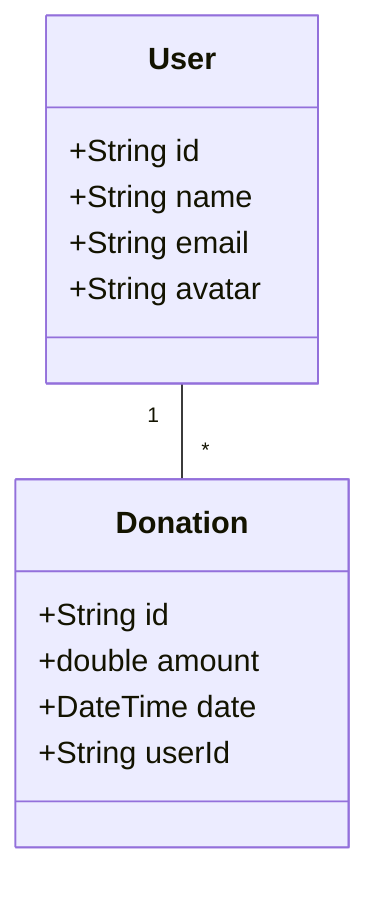
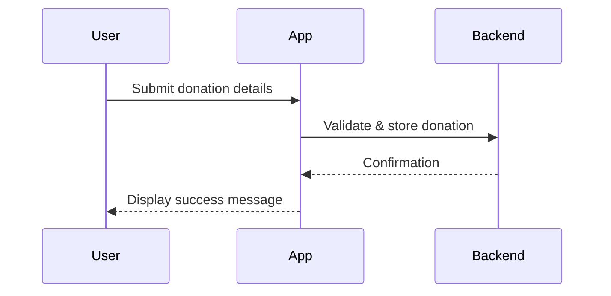

# Conception Phase

This document expands on the initial planning and design phase of the NoorFunds mobile application. It provides a comprehensive overview of goals, features, and architectural decisions made before development.

## Vision
NoorFunds aims to simplify charitable donations by giving users a single, secure place to record contributions and export analytics. The app is built with Flutter to reach both Android and iOS users with a consistent experience.

## Objectives
- Research market needs for a donation management tool.
- Define key user personas and their goals.
- Draft early wireframes for primary screens.
- Outline a scalable architecture leveraging Flutter and a backend API.

## Key Features Identified
1. **Onboarding & Authentication** – Guide new users and secure access through login and registration screens.
2. **Donation Dashboard** – Overview of recent donations and quick actions.
3. **Record Donations** – Allow manual entry or OCR scanning of receipts.
4. **Export Analytics** – Generate CSV or PDF reports for personal accounting.
5. **Settings & User Profiles** – Manage preferences, avatars, and privacy options.

## Use Case Diagram
```mermaid
usecaseDiagram
  actor User
  actor Admin
  User -- (Register)
  User -- (Login)
  User -- (View Dashboard)
  User -- (Add Donation)
  User -- (Export Analytics)
  Admin -- (Manage Users)
  Admin -- (View Reports)
```

## Core Domain Model


## Donation Flow (Sequence)


## Additional Notes
- Initial wireframes were created for the splash screen, onboarding flow, and dashboard using Figma.
- The architecture follows a clean separation of layers: **presentation**, **domain**, and **data**.
- Further diagrams such as state charts and component diagrams will be added as the project evolves.

