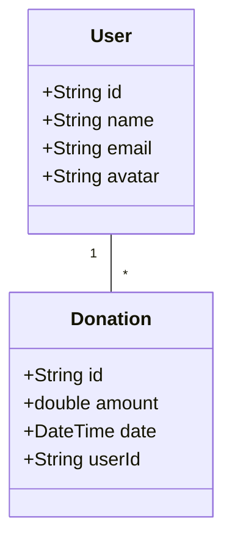
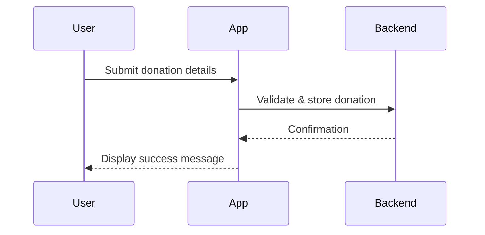

# Conception Phase
This document expands on the initial planning and design phase of the NoorFunds mobile application. It provides a comprehensive overview of goals, features, and architectural decisions made before development.

## Vision
NoorFunds aims to simplify charitable donations by giving users a single, secure place to record contributions and export analytics. The app is built with Flutter to reach both Android and iOS users with a consistent experience.

## Objectives
- Research market needs for a donation management tool.
- Define key user personas and their goals.
- Draft early wireframes for primary screens.
- Outline a scalable architecture leveraging Flutter and a backend API.

## Key Features Identified
1. **Onboarding & Authentication** – Guide new users and secure access through login and registration screens.
2. **Donation Dashboard** – Overview of recent donations and quick actions.
3. **Record Donations** – Allow manual entry or OCR scanning of receipts.
4. **Export Analytics** – Generate CSV or PDF reports for personal accounting.
5. **Settings & User Profiles** – Manage preferences, avatars, and privacy options.

## Use Case Diagram
```mermaid
usecaseDiagram
  actor User
  actor Admin
  User -- (Register)
  User -- (Login)
  User -- (View Dashboard)
  User -- (Add Donation)
  User -- (Export Analytics)
  Admin -- (Manage Users)
  Admin -- (View Reports)
```

## Core Domain Model


## Donation Flow (Sequence)


## Additional Notes
- Initial wireframes were created for the splash screen, onboarding flow, and dashboard using Figma.
- The architecture follows a clean separation of layers: **presentation**, **domain**, and **data**.
- Further diagrams such as state charts and component diagrams will be added as the project evolves.

The conception phase establishes the vision and foundation for the NoorFunds application. NoorFunds is a cross-platform app designed to help users securely manage donation records, scan receipts, and analyze charitable contributions. The goal is to make tracking donations simple while ensuring privacy and ease of use on both Android and iOS.

## 1. Needs Analysis

### Stakeholders
- **Individual Donors** – keep an organized log of donations and receipts.
- **Charitable Institutions** – verify donation records, provide digital receipts.
- **Administrators** – manage user accounts, ensure data integrity.

### Functional Requirements
- Capture donation records with details such as donor name, date, and amount.
- Scan physical receipts using the device camera and extract text via OCR.
- Persist records locally and allow exporting analytics as CSV or charts.
- Support onboarding flow, authentication, and profile settings.

### Non‑Functional Requirements
- Cross-platform Flutter codebase for Android and iOS.
- Responsive design adaptable to different screen sizes.
- Local storage for offline access and privacy of sensitive data.
- Fast OCR processing and efficient database queries.
- Intuitive user experience with dark and light themes.

## 2. Architecture Overview

```
+---------------+
| Presentation  |
|  (Flutter UI) |
+-------+-------+
        |
        v
+-------+-------+
|  Services     |
| (Camera, OCR) |
+-------+-------+
        |
        v
+-------+-------+
|  Data Layer   |
| (SQLite, API) |
+---------------+
```
The UI communicates with service classes that handle camera access, OCR, and exporting data. Services read and write donation records through a local SQLite database or network API when available.

## 3. Data Model

```
users
-----
- id (PK)
- email
- password

donations
---------
- id (PK)
- user_id (FK -> users.id)
- donor_name
- amount
- date
- notes
```
The database schema mirrors the `ParsedReceipt` model in `lib/models` for storing parsed receipt details.

## 4. Key Use Cases

1. **Record Donation**
   - User opens the camera scan screen.
   - Captures a receipt image.
   - OCR service parses the image and fills in donation fields.
   - User confirms or edits the details and saves the record.

2. **View Analytics**
   - User navigates to the analytics screen.
   - The app aggregates donation amounts and displays charts.
   - User exports results to CSV if desired.

3. **Manage Settings**
   - User updates profile information and theme preferences.
   - Onboarding state is stored so the tutorial only appears once.

## 5. Future Enhancements
- Sync with cloud services for backup and multi-device access.
- Advanced search and filtering of donation records.
- Integration with third-party payment or donation platforms.

The conception phase lays out these core requirements and structural decisions, guiding subsequent design and development steps.

